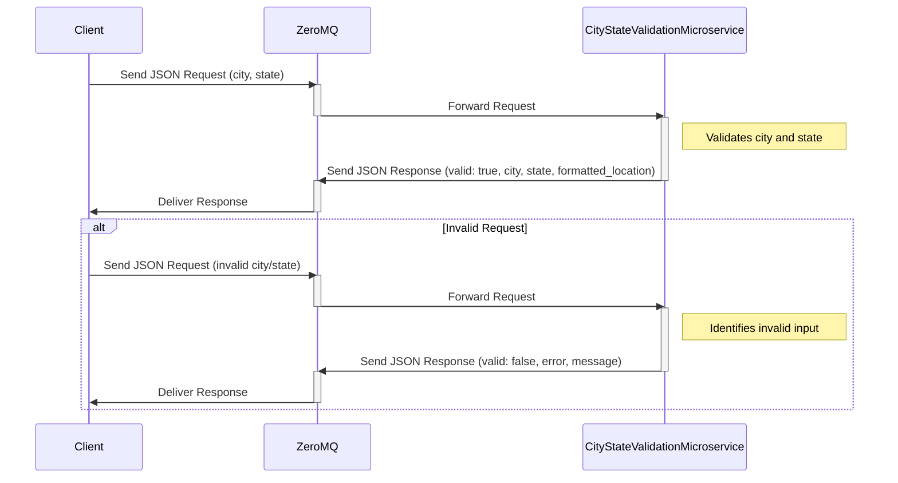

# City-State Validation Microservice

This microservice verifies whether a provided U.S. city and 2-letter state abbreviation represent a valid location. 

---

## Requesting Data

To **request data**, send a JSON request using ZeroMQ with the following format:

### Request Format

```json
{
  "city": "TestCity",
  "state": "TS"
}
```

- `"city"`: Name of the city (case-insensitive)
- `"state"`: 2-letter U.S. state abbreviation (uppercase)

### Example Code (Sending a Request with ZeroMQ in Python)

```python
import zmq
import json

context = zmq.Context()
socket = context.socket(zmq.REQ)
socket.connect("tcp://localhost:5555")  # Replace with the correct endpoint

request_data = {
    "city": "Corvallis",
    "state": "OR"
}

socket.send_string(json.dumps(request_data))
```

---

## Receiving Data

The response from the microservice will be a JSON object.

### Response Format

#### Valid Request Example

```json
{
  "valid": true,
  "city": "Corvallis",
  "state": "OR",
  "formatted_location": "Corvallis, OR"
}
```

#### Invalid Request Example

```json
{
  "valid": false,
  "error": "state",
  "message": "State must be a valid two-letter U.S. abbreviation (e.g., 'CA')."
}
```

### Example Code (Receiving a Response)

```python
response = socket.recv_string()
response_data = json.loads(response)
```

---

## UML Sequence Diagram

The following UML sequence diagram shows how the main program interacts with the microservice to request and receive validation data:



---

## Notes

- This microservice only validates **U.S. cities and states**.
- Requests must include both `city` and `state`.
- Responses are returned in stringified JSON format for compatibility with ZeroMQ transmission.
